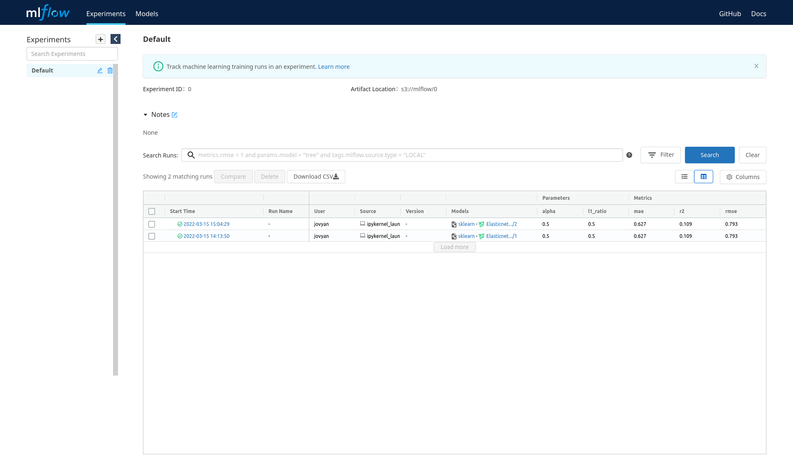

# Kubeflow + MLflow on Juju with Microk8s

- [Kubeflow + MLflow on Juju with Microk8s](#kubeflow--mlflow-on-juju-with-microk8s)
  - [Get Started](#get-started)
    - [Deploy Standalone mlflow-server](#deploy-standalone-mlflow-server)
    - [Deploy mlflow-server with kubeflow](#deploy-mlflow-server-with-kubeflow)
  - [MLFlow Dashboard](#mlflow-dashboard)
  - [Run an Example Model with Kubeflow](#run-an-example-model-with-kubeflow)
  - [Access Artifacts](#access-artifacts)
    - [Get minio key and secret](#get-minio-key-and-secret)
    - [minio client](#minio-client)
    - [boto3](#boto3)

## Get Started

### Deploy Standalone mlflow-server
```shell
juju deploy mlflow-server
juju deploy charmed-osm-mariadb-k8s mlflow-db
juju deploy minio
juju relate minio mlflow-server
juju relate mlflow-db mlflow-server
```

You could then use [MLFlow Tracking API](https://www.mlflow.org/docs/latest/tracking.html#logging-data-to-runs) in your script to record your runs.

### Deploy mlflow-server with kubeflow
Follow the [quick start guide](https://charmed-kubeflow.io/docs/quickstart) to deploy kubeflow on microk8s.

```shell
juju deploy mlflow-server
juju deploy charmed-osm-mariadb-k8s mlflow-db
juju relate minio mlflow-server
juju relate istio-pilot mlflow-server
juju relate mlflow-db mlflow-server
juju relate mlflow-server admission-webhook
```

## MLFlow Dashboard

If you deployed MLFlow with Kubeflow, you could access the dashboard by going to [http://10.64.140.43.nip.io/mlflow/#/](http://10.64.140.43.nip.io/mlflow/#/)
Otherwise, run `microk8s kubectl get services -A | grep "mlflow-server"`, and open the `mlflow` `ClusterIP` in the browser with `:5000` on the end.



## Run an Example Model with Kubeflow

First, deploy MLFlow server with kubeflow.

Temporary workaround for missing pod-defaults:
Run the following command to make a copy of pod defaults to user's namespace, which is `admin` following the guide.
`microk8s kubectl get poddefaults mlflow-server-minio -o yaml -n kubeflow | sed 's/namespace: kubeflow/namespace: admin/' | microk8s kubectl create -f -`

Open [http://10.64.140.43.nip.io/](http://10.64.140.43.nip.io/) and log in with the username and password set in the quick start guide.

Create a new notebook server, taking care to specify the `mlflow-server-minio` configuration. This will ensure that the correct environment variables are set so that the MLflow SDK can connect to the MLflow server.


Upload or paste in the [example model code](./examples/elastic_net_wine_model.ipynb) to the notebook server.

Run the first two cells and observe that your model metrics are recorded in MLflow!
Run the other two cells to view list of files in the object storage and download a file to the notebook server.


## Access Artifacts
Based on the setup in the Get Started section, artifacts would be stored in minio.
You could access the artifacts using the minio client or boto3 with python.

### Get minio key and secret

Find admission webhook unit's name
`juju status | grep admission-webhook/`

Run the command below to get minio envs 
```shell
juju show-unit <admission webhook unit name> | yq .admission-webhook/*.relation-info[0].application-data

# expect result
pod-defaults: '{"minio": {"env": {"AWS_ACCESS_KEY_ID": "some id", "AWS_SECRET_ACCESS_KEY": "some secret key", "MLFLOW_S3_ENDPOINT_URL": "http://minio.kubeflow:9000", "MLFLOW_TRACKING_URI": "http://mlflow-server.kubeflow.svc.cluster.local:5000"}}}'
```

### minio client

Install minio client following the [official guide](https://docs.min.io/docs/minio-client-quickstart-guide.html).

Set alias for the minio
```
mc alias set <alias> http://`juju status --format yaml | yq .applications.minio.units.minio/*.address`:9000 $AWS_ACCESS_KEY_ID $AWS_SECRET_ACCESS_KEY
```

To list content in the default mlflow bucket:
```
mc ls <alias>/mlflow
```

To read the content of a specific file:
```
mc cat <alias>/<path to file>
```

### boto3
These code are also included in the [example notebook](./examples/elastic_net_wine_model.ipynb).
```python
import boto3
minio = boto3.client(
        "s3",
        endpoint_url=os.getenv("MLFLOW_S3_ENDPOINT_URL"),
        config=boto3.session.Config(signature_version="s3v4"),
    )
```
Note: If you are accessing the bucket outside of a kubeflow notebook server, replace the os env with minio unit's ip with `:9000` at the end.
Run this in the terminal to get the ip: 
```shell
echo http://`juju status --format yaml | yq .applications.minio.units.minio/*.address`:9000
```
<br>

To list of files in the default bucket `mlflow`:
```python
response = minio.list_objects_v2(Bucket="mlflow")
files = response.get("Contents")
for file in files:
    print(f"file_name: {file['Key']}, size: {file['Size']}")
```

To download a specific file:
```python
minio.download_file(default_bucket_name,'<minio file path>', '<notebook server file path>')
```